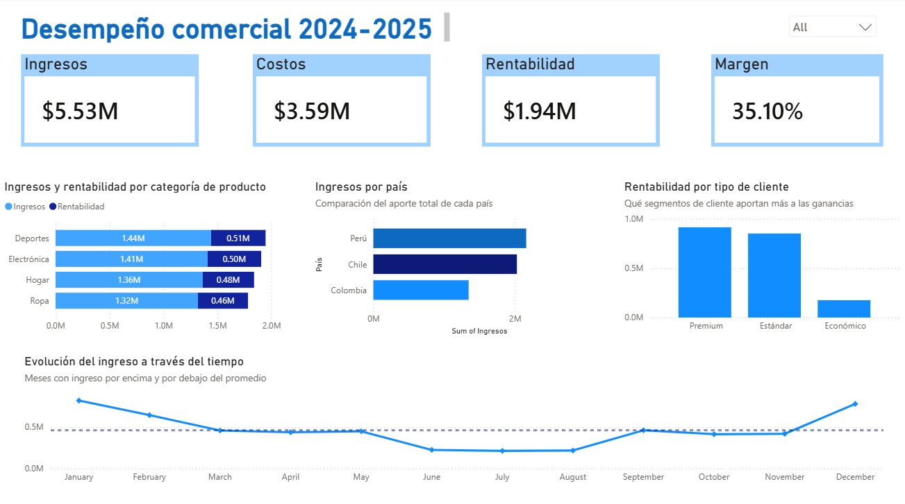
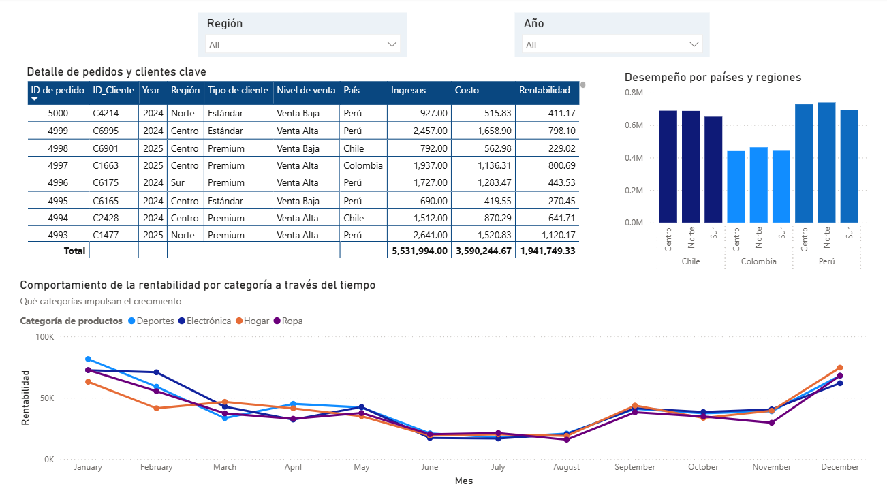

# **📊 Dashboard de Desempeño Comercial 2024–2025**
Empresa: Andes Retail Group  
Herramienta: Power BI Desktop

## 🧩 Descripción del Proyecto
Este proyecto desarrolla un dashboard ejecutivo de desempeño comercial para Andes Retail Group, con el objetivo de analizar la evolución de ingresos, costos, rentabilidad y márgenes entre 2024 y 2025.

El análisis combina modelado de datos, transformación con Power Query, diseño visual estratégico y narrativa ejecutiva, orientado a la toma de decisiones.

## 🎯 Objetivo General
Construir un dashboard profesional que permita responder:

**¿Cómo ha evolucionado el desempeño comercial entre 2024 y 2025 y qué factores explican las variaciones observadas?**

## 🛠️ Metodología
### 1. Conexión y Exploración de Datos
Importación del archivo Excel en Power BI Desktop.

Revisión y corrección de tipos de datos.

Identificación de columnas clave para el análisis.

Exploración de la estructura general del dataset.

### 2. Transformación en Power Query
Conversión del campo Fecha_pedido a formato español (Latinoamérica).

Corrección de tipos de datos numéricos.

Creación de columna condicional Nivel_Venta:

Ingresos ≥ 1000 → Venta Alta

Ingresos < 1000 → Venta Baja

Validación de calidad mediante Vista Perfil de Columna.

Preparación del dataset para análisis y modelado.

### 3. 🧠 Diseño y Planificación del Dashboard
## 🖥️ Vista Overview

Pregunta principal:  
**¿Cómo ha evolucionado el ingreso total entre 2024 y 2025?**

### KPIs seleccionados
- Ingresos Totales – Indicador principal del desempeño comercial.

- Costos Totales – Permite evaluar eficiencia operativa.

- Rentabilidad Total – Valor generado después de cubrir costos.

- Margen (%) – Relación entre rentabilidad e ingresos.

### Visualizaciones y justificación
- Línea temporal (Ingresos mensuales)

Muestra tendencias, estacionalidad y comparación 2024 vs 2025.

- Barras por categoría de producto

Identifica categorías con mayor impacto en ingresos y rentabilidad.

- Barras por tipo de cliente

Permite evaluar segmentos de alto y bajo valor.

- Barras geográficas (Ingresos por país)

Destaca mercados fuertes y débiles.

### Jerarquía visual
Título: “Desempeño Comercial 2024–2025”

KPIs principales (tarjetas superiores)

Gráfico temporal central

Gráficos comparativos (categorías, países, clientes)

Segmentador principal: Año

## 🔍 Vista Detalle

Pregunta:  
**¿Qué factores explican la caída, aumento o estabilidad de los ingresos?**

### Visualizaciones
- Gráfico estacional (línea): Rentabilidad por mes y categoría

Identifica picos, caídas y estacionalidad por categoría.

- Barras geográficas: Ingresos por país y región

Detecta mercados que impulsan o frenan el crecimiento.

- Tabla detallada de pedidos (fact table)  
Incluye:

  ID_Pedido

  ID_Cliente

  Año

  Región

  Tipo de cliente

  Nivel de venta

  País

  Ingresos

  Costo

  Rentabilidad

Propósito:  
Auditar datos, identificar anomalías, analizar clientes clave y explicar variaciones.

- Segmentadores

  Región

  Año

## 🧵 Narrativa Ejecutiva (Modelo SCQA)
### 🖥️ Vista General (Overview)
S – Situación:  
El negocio muestra su desempeño global entre 2024 y 2025, considerando ingresos, costos, rentabilidad y margen.

C – Complicación:  
Los ingresos presentan fluctuaciones relevantes y diferencias entre países, categorías y segmentos.

Q – Pregunta:  
¿Cómo ha evolucionado el ingreso total y qué factores influyen en esa evolución?

A – Respuesta:  
La tendencia evidencia estacionalidad marcada, con picos y caídas explicados por variaciones en categorías clave y diferencias entre mercados.

### 🔎 Vista Detalle
S – Situación:  
Se analizan pedidos, clientes, regiones, categorías y meses a nivel granular.

C – Complicación:  
La variación no es uniforme: algunos mercados impulsan el crecimiento mientras otros lo frenan.

Q – Pregunta:  
¿Qué elementos específicos explican la caída, aumento o estabilidad de los ingresos?

A – Respuesta:  
Las variaciones se explican por desempeño desigual entre países, estacionalidad por categoría y diferencias entre segmentos de cliente. La tabla detallada permite identificar pedidos y clientes clave.

## 💬 Mensaje Ejecutivo (Slack – Modelo SCQA)
📊 Actualización de desempeño comercial

Equipo, durante 2024–2025 observamos variaciones importantes en los ingresos, con una caída marcada en el primer semestre y una recuperación hacia fin de año. El crecimiento está impulsado por Perú y las categorías de Deportes/Electrónica, mientras que Colombia y segmentos de bajo margen explican las caídas.

Hay oportunidades claras en optimizar regiones débiles y potenciar segmentos Premium.

## 🚀 Entrega Final
El proyecto puede consultarse mediante:

🔗 Imágenes al final de este repositorio

✔️ Archivo incluido directamente en este repositorio

  

  

